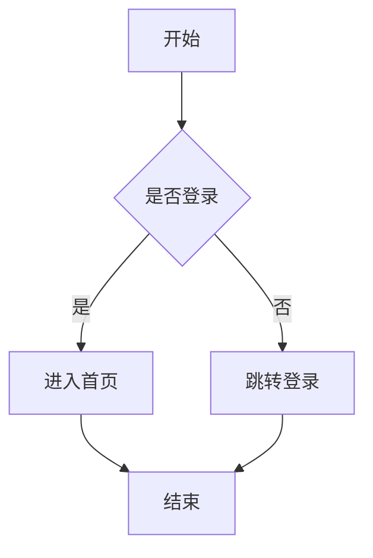
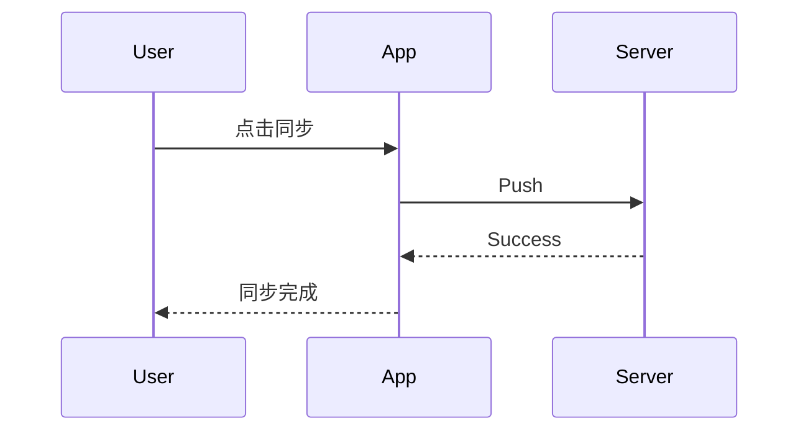
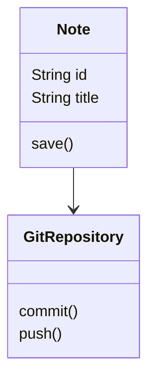
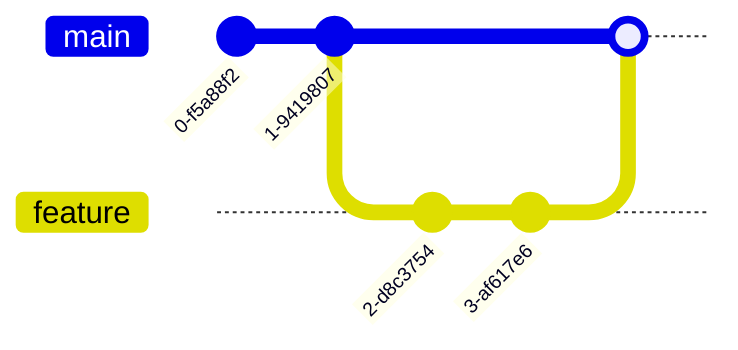
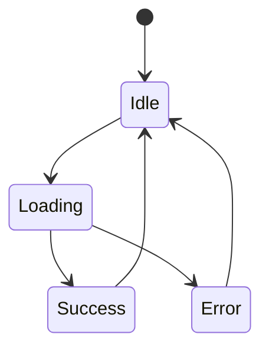
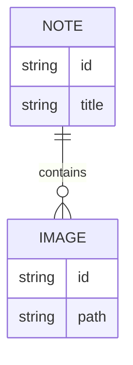
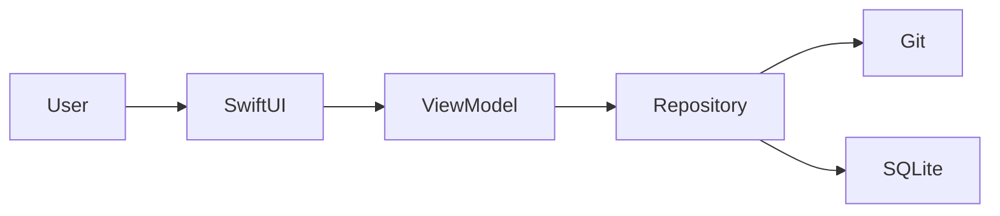

# 笔记示例

# Markdown 完整示例

> Markdown 是一种轻量级标记语言。
>
> 支持 **加粗**、*斜体*、代码块、表格、数学公式等。

---

# 1. 标题

# 一级标题

## 二级标题

### 三级标题

#### 四级标题

##### 五级标题

###### 六级标题

---

# 2. 文本格式

普通文本

**加粗**

__加粗__

*斜体*

_斜体_

***加粗斜体***

~~删除线~~

<u>下划线（HTML）</u>

---

# 3. 分割线

***

---

# 4. 引用

> 一级引用

>> 二级引用

>>> 三级引用

---

# 5. 列表

## 无序列表

- 苹果
- 香蕉
- 西瓜

* 苹果
* 香蕉
* 西瓜

+ 苹果
+ 香蕉
+ 西瓜

## 有序列表

1. 第一项
2. 第二项
3. 第三项

## 嵌套列表

1. 编程语言
   - Swift
   - Go
   - Python
2. 数据库
   - SQLite
   - PostgreSQL

---

# 6. 任务列表

- [x] 完成登录
- [x] 完成首页
- [ ] 完成同步功能
- [ ] 发布 App Store

---

# 7. 行内代码

使用 `git commit` 提交代码。

使用 `SwiftUI` 构建界面。

---

# 8. 代码块

## Swift

```swift
import SwiftUI

struct ContentView: View {
    @State private var count = 0

    var body: some View {
        VStack {
            Text("Count: \(count)")
            Button("Add") {
                count += 1
            }
        }
    }
}
```

## Go

```go
package main

import "fmt"

func main() {
    fmt.Println("Hello World")
}
```

## Python

```python
def fibonacci(n):
    if n <= 1:
        return n
    return fibonacci(n-1) + fibonacci(n-2)

print(fibonacci(10))
```

## JSON

```json
{
  "name": "Git记",
  "version": "1.0.0",
  "platform": "iOS"
}
```

## Shell

```bash
git add .
git commit -m "feat: add sync"
git push origin main
```

---

# 9. 链接

普通链接：

https://github.com

Markdown链接：

[GitHub](https://github.com)

带标题：

[GitHub](https://github.com "GitHub")

---

# 10. 图片

## 网络图片


## 指定尺寸（HTML）


---

# 11. 表格

| 名称 | 语言 | 平台 |
|------|------|------|
| Git记 | Swift | iOS |
| OpenClaw | Go | Web |
| ChatGPT | Python | AI |

## 对齐方式

| 左对齐 | 居中 | 右对齐 |
| :----- | :--: | -----: |
| Apple | Swift | 100 |
| Google | Kotlin | 200 |

---

# 12. 转义字符

\*不是斜体\*

\#不是标题

\`不是代码\`

---

# 13. 数学公式

## 行内公式

爱因斯坦公式：

$E = mc^2$

## 块公式

$$
E = mc^2
$$

### 求和

$$
\sum_{i=1}^{n} i
=
\frac{n(n+1)}{2}
$$

### 积分

$$
\int_0^1 x^2 dx
=
\frac{1}{3}
$$

### 矩阵

$$
\begin{bmatrix}
1 & 2 \\
3 & 4
\end{bmatrix}
$$

### 概率

$$
P(A|B)
=
\frac{P(B|A)P(A)}{P(B)}
$$

---

# 14. Mermaid 流程图



---

# 15. Mermaid 时序图



---

# 16. Mermaid 类图



---

# 17. Mermaid Git 图



---

# 18. Mermaid 状态图



---

# 19. Mermaid ER 图



---

# 20. HTML 扩展

<details>
<summary>点击展开</summary>

隐藏内容

- 内容1
- 内容2

</details>

---

# 21. 综合示例

## Git记

> 基于 Git 的 Markdown 笔记应用

### 功能

- [x] Markdown编辑
- [x] Git同步
- [x] 图片管理
- [ ] Todo管理
- [ ] AI助手

### 架构图



### 数据模型

```swift
struct Note {
    let id: String
    let title: String
    let content: String
}
```

### 数学公式

$$
f(x)=x^2+2x+1
$$

### 示例图片


### 示例表格

| 功能 | 状态 |
|------|------|
| Markdown | ✅ |
| Git同步 | ✅ |
| Todo | 🚧 |

---

结束 🎉